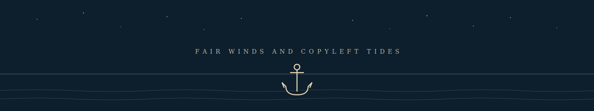

  

# Klazomenai

> Open-source platform engineer. Building voice-driven AI to take dev work outside the screen.

## Currently

Twenty years in IT — the body has filed complaints. So I'm building tools that
let me do the work standing on a clifftop, walking a coastline, or anywhere
the screen isn't the centre of attention. That's the **Offshore Fleet** below:
a voice-first AI crew you talk to through a bone-conduction headset, with a
phone in your pocket as the only display, end-to-end encrypted Matrix as the
wire, and your own infrastructure underneath.

**Sails trimmed for new shores** — open to contract work in cloud platforms,
identity & SSO, and decentralised infrastructure.
Reach me at [`klazomenai.dev@proton.me`](mailto:klazomenai.dev@proton.me).

## The Stewardship Promise

Klazomenai-led projects are licensed AGPL-3.0-or-later (or, where the use case
is a permissively-licensed library, MIT). The current open-source release stays
open, in perpetuity. Future development may move between OSI-approved licences
but never to proprietary or source-available terms. Forks are honoured.
Decisions are visible.

Read the full commitment in
[chart-house/STEWARDSHIP.md](https://github.com/Klazomenai/chart-house/blob/main/STEWARDSHIP.md).

## Active Workstreams

### 🏴‍☠️ Offshore Fleet — Voice-driven AI crew

The most active workstream. A voice-first AI crew you talk to through a
bone-conduction Bluetooth headset: offline speech-to-text, end-to-end
encrypted messages over Matrix, multi-model agentic orchestration via
Claude, text-to-speech crew voices for the reply. Self-hosted on your
own infrastructure.

| Repo | Role | Stack | Licence |
|---|---|---|---|
| [bridge](https://github.com/Klazomenai/bridge) | Matrix bot + AI crew orchestrator | Go | AGPL-3.0-or-later |
| [deck-chat](https://github.com/Klazomenai/deck-chat) | Android voice client | Kotlin | AGPL-3.0-or-later |
| [chart-house](https://github.com/Klazomenai/chart-house) | Voyage planner — fleet landing page | Zola, SCSS | AGPL-3.0-or-later |

### 📜 The Letter of Marque — Identity and on-chain authority

A privateer's letter of marque was the sovereign's written authorisation to
act — verifiable, scoped, recognisable at distance. This workstream is the
modern equivalent for distributed systems: prove who you are with an EVM
wallet, prove what you may do with on-chain access control, then carry that
authority into Kubernetes-shaped infrastructure as a JWT validated at the
edge.

| Repo | Role | Stack | Licence |
|---|---|---|---|
| [KeyRA](https://github.com/Klazomenai/KeyRA) | EVM wallet authentication gateway (SIWE + on-chain access control) | Rust, Foundry | MIT |
| [jwt-auth-service](https://github.com/Klazomenai/jwt-auth-service) | JWT issuance, validation, and revocation | Go, Redis | MIT |
| [istio-jwt-wasm](https://github.com/Klazomenai/istio-jwt-wasm) | Istio Gateway-level JWT enforcement | Go (WASM) | MIT |

### 🛠 The Drydock — Reproducible blockchain stack

The drydock is where ships are built and refit, hull fully exposed, every
fastener accounted for. This workstream takes the
[Autonity](https://github.com/autonity/autonity) EVM client and the
[Blockscout](https://github.com/blockscout/blockscout) explorer and rebuilds
them as pure NixOS service modules — bit-reproducible, hardening matrix
encoded as a flake check, deployable to a single host with no containers in
the runtime path.

| Repo | Role | Stack | Licence |
|---|---|---|---|
| [autonity-blockscout-nixos](https://github.com/Klazomenai/autonity-blockscout-nixos) | NixOS service modules + flake | Nix | GPL-3.0 |
| [autonity](https://github.com/Klazomenai/autonity) (fork) | Autonity Go Client packaged via `buildGoModule` | Go | LGPL-3.0 |
| [blockscout](https://github.com/Klazomenai/blockscout) (fork) | Blockchain explorer packaged via `mixRelease` | Elixir | GPL-3.0 |
| [blockscout-frontend](https://github.com/Klazomenai/blockscout-frontend) (fork) | Explorer frontend packaged via pnpm/Next.js standalone | TypeScript | GPL-3.0 |
| [autonity-cli](https://github.com/Klazomenai/autonity-cli) (fork) | Autonity CLI with JWT-authenticated RPC | Python | MIT |
| [tide](https://github.com/Klazomenai/tide) | Slack bot faucet for Autonity testnets | Python | MIT |

### ⚓ The Ditty Bag — Shared toolkit

A sailor's ditty bag is the small canvas pouch of personal kit — needles,
thread, marlinspike, the things that keep the rest of the work moving.
Shell config, Claude Code skills and hooks, Nix dev environments, and the
glue that ties the rest of the fleet together.

| Repo | Role | Stack | Licence |
|---|---|---|---|
| [dotfiles](https://github.com/Klazomenai/dotfiles) | Shell config, Claude Code skills + hooks, dev environments | Shell, Nix | GPL-3.0 |

<strong>Older charts</strong>

Smaller utilities still serviceable but no longer under active development.

- [haggis](https://github.com/Klazomenai/haggis) — GitHub search inspection tool (Go, GPL-3.0)
- [DEVToken](https://github.com/Klazomenai/DEVToken) — Reference ERC-20 for Autonity testing (Python, MIT)

---

Fair winds and copyleft tides 🌊

*Last refit: 2026-05-02*
